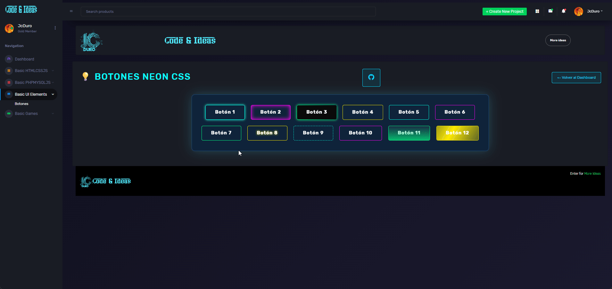

# ⚡ Botones Neón

Una colección de **12 botones animados en 4 colores neón**, creados con **HTML y CSS puro**.  
Cada botón tiene un estilo y animación distinta: brillos, bordes dinámicos, ondas expansivas, rotación 3D, y más.  

---

## ✨ Vista previa



> **

--- 

## ✨ Pruebalo Online

[Botones_Neon](https://jcduro.bexartideas.com/proyectos/dashjc/botones_neon/botones.php)

--- 

## 🧩 Características

- 🎨 12 efectos diferentes de animación neón  
- 🌈 4 colores personalizables:  
  - Cian `#00ffe1`  
  - Fucsia `#ff00f7`  
  - Verde `#00ff85`  
  - Amarillo `#ffea00`  
- 💡 Incluye efectos de:
  - Brillo, borde animado, halo, pulso, rotación 3D, lluvia de luz, borde líquido y más  
- ⚙️ 100% en **HTML + CSS** (sin JavaScript)  
- 🧠 Diseño responsive y moderno  

---

## 📊 Lenguajes y Herramientas

[](https://skillicons.dev)

---

## 🚀 Cómo usarlo localmente

1. Clona el repositorio:
   ```bash
   git clone https://github.com/jcduro/Botones_neon.git
   cd Botones_neon


   --- 

## 📄 Licencia
Libre, usalo como quieras
<div align="center">
  Hecho con 💙 y neones
</div>

---

## ⭐ Si te gustó este proyecto, no olvides dejar una estrella en GitHub!
